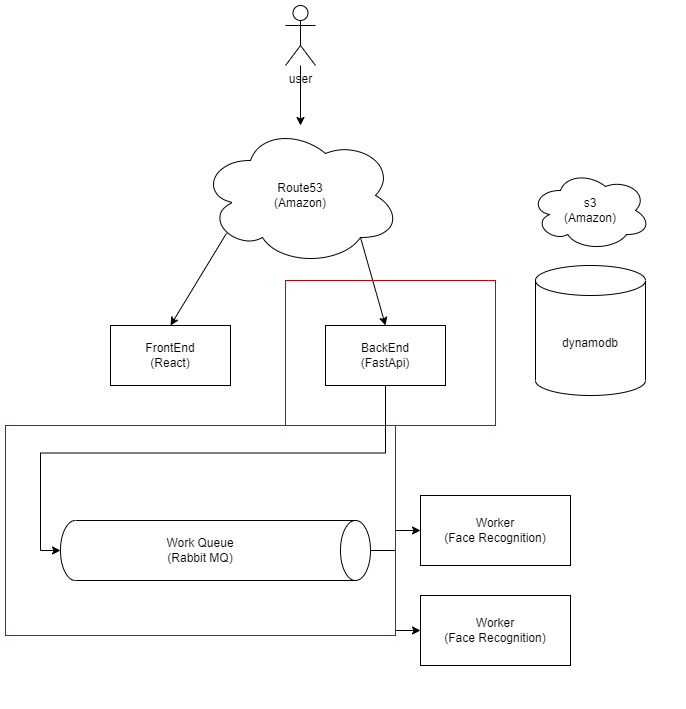

# Capstone Design1 - Video Summarizer Server

## 다이어그램의 해당 영역을 담당합니다.



## 사용 기술

-   FastApi
-   DynamoDb
-   AWS S3

## To start

```
> add poetry : pip install poetry
> add dependency : poetry install
> run project : poetry run poe app
```
need .env file
```
dynamodb_url: str
dynamodb_aws_access_key_id: str
dynamodb_aws_secret_access_key: str
rabbit_host : str
rabbit_port : int
rabbit_key : str
```
## Project Structure

- interface
- infrastructure

간단한 API서버를 구현하였기 때문에, 두개의 레이어로 구성되었습니다.

데이터베이스를 추상화하기 위한 Repository와 API들을 모아둔 interface레이어입니다.


## Reference

python-DDD(https://www.amazon.com/Architecture-Patterns-Python-Domain-Driven-Microservices/dp/1492052205)
